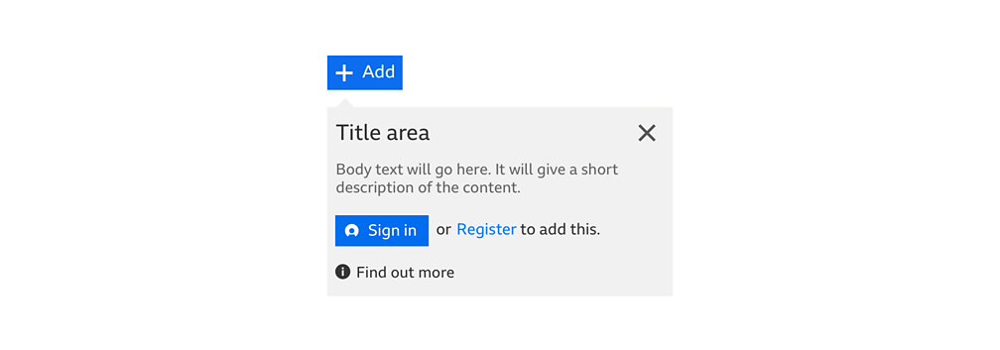

# 3 patterns: Modal dialogs, non-modal dialogs, disclosure pattern

- It’s helpful to distinguish between three web design patterns: “modal dialog”, “non-modal dialog” and “disclosure”.

## 1. Modal dialog

- It’s common to use “modal” as a noun. But to talk precisely, [in web design "modal" is actually an adjective](https://www.w3.org/TR/wai-aria-practices-1.1/#dialog_modal).

- A dialog is “modal” if no link/button/form control outside it can be interacted with while it is visible”. ([Example](https://kompass.kooth.com/modal-dialog))

### Are modal dialogs bad for accessibility?

- [“Modal dialogs” are often used in ways that hurt usability and user experience](https://modalzmodalzmodalz.com/).
  - So it’s better to avoid them when another pattern works better, and to be careful with them.

- But [sometimes, modal dialogs are the right pattern](https://www.nngroup.com/articles/modal-nonmodal-dialog/).

- From an accessibility point of views, there are many many ways to get modal dialogs wrong and to introduce accessibility issues.
  - [Often, elements behind a modal are still reachable and that’s super confusing](https://youtu.be/OUDV1gqs9GA?t=1318).
  - Or, where should the keyboard focus move to when a modal appears, so that keyboard users and screen reader users aren’t lost?
  - To avoid those issues, we’ve built a rock solid, customisable KModal component that takes care of all that complexity.

## 2. “non-modal dialog” (or just “dialog”) 

- A "non-modal dialog" (or just "dialog") is like a window/box that’s overlaid on the other content (so, it hides some of the page’s content), but it’s still possible to interact with things outside the modal.

- Here’s an example from the [BBC design system](https://www.bbc.co.uk/gel/guidelines/content-utilities).

<figure>  
  
  <figcaption>Clicking this 'Add' button makes a dialog appear below it</figcaption>
</figure>

## 3. Disclosure pattern

- In Kooth's navigation, the user menu and the “More navigation links” menus are not modals and not dialogs either.
  - It’s just a button, that, when clicked, gets `aria-expanded=true` and makes content appear immediately after it.

- They follow the [“disclosure” pattern](https://www.w3.org/TR/wai-aria-practices-1.1/#disclosure) instead. ([Example](https://www.w3.org/TR/wai-aria-practices-1.1/examples/disclosure/disclosure-navigation.html)).

### Are disclosured bad for accessibility?

- It’s perfectly fine to do that (provided that the content that appears is indeed immediately after the button).
- There are a few ways to get it wrong, but those are just implementation details. QAing using the keyboard alone is essential.
